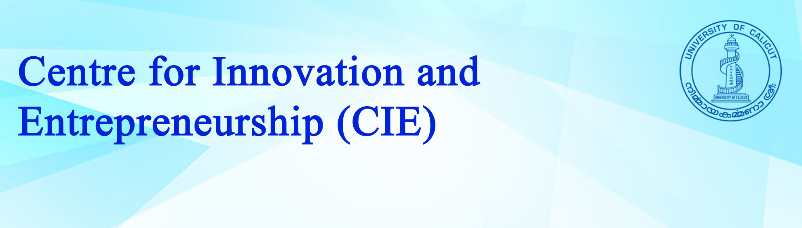

STEM Innovation Camp: Science, Electronics, and AI  2-Day Hands-on Training Workshop

## Program for the next batch : Registrations open

[Program Info!](../details){:class="large-button primary"  target="_blank"}
[Register Now!](https://forms.gle/ARihSSCncDVzfgaMA){:class="large-button secondary" target="_blank"}

We offer programs for school groups of 40 students. Faculties of interested schools can contact us to book. 
Contact: Director, Centre for Innovation & Entrepreneurship, University of Calicut

email:  cie@uoc.ac.in

### Program Dates (Ongoing and Upcoming Batches)

+ Batch 4: Dates will updated soon (it will be after 7th September) -[Registration Open](https://forms.gle/ARihSSCncDVzfgaMA){:target="_blank"}
+ Batch 4: 18th September (Wed) and 20th September (Fri)-Registration Closed 
+ Batch 3: 17th August (Sat) and 24th August (Sat)-Registration Closed 
+ Batch 2: 10th August (Sat) and 15th August (Thu)-Registration Closed 
+ Batch 1: 20th July (Sat) and 27th July (Sat)-Registration Closed

## [Photo Gallery](https://sites.google.com/uoc.ac.in/from-blocks-to-bots/gallery?authuser=0){:target="_blank"}

  
  
  
  
  
  

 
<iframe width="100%" height="400" src="https://www.youtube.com/embed/PFh62AY8tZE" title="Running LEDs in KuttyPy | LED animation | Register manipulation | workshop University of Calicut" frameborder="0" allow="accelerometer; autoplay; clipboard-write; encrypted-media; gyroscope; picture-in-picture; web-share" referrerpolicy="strict-origin-when-cross-origin" allowfullscreen></iframe>

# About CIE
The University of Calicut has established the Centre for Innovation and Entrepreneurship (CIE) with the mission 
of fostering a culture of innovation among students and research scholars, as well as supporting startups and 
business ventures initiated by faculty, students, and researchers. The CIE hosts an incubation centre, 
a Fabrication Laboratory (FabLab), and a Training & Skilling Centre. The Centre was officially inaugurated 
on 16.01.2024 by the Honourable Minister for Public Works, Tourism, and Youth Affairs, Sri P. A. Mohammed Riyas.
