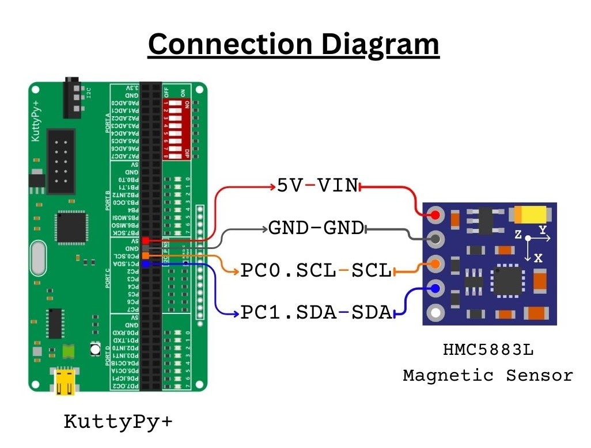
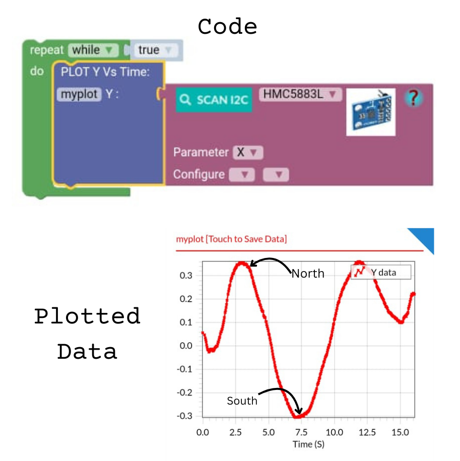

# Plotting data using Magnetic sensor

**The sensor used: HMC5883L /  HMC5883L**

  

Using the visual code, the KuttyPy+ takes in the sensor data from an I2C magnetic sensor and plots it on a time graph.

 Activity: The participants are instructed to find the magnetic North pole and South pole using the sensor.

/// html | div[style='clear: both;']
///

  

<iframe class="dual-stackable" height="315" src="https://www.youtube.com/embed/bh9dyZ-7pNU?si=RKC7xV2r_zvQSX3R" title="YouTube video player" frameborder="0" allow="accelerometer; autoplay; clipboard-write; encrypted-media; gyroscope; picture-in-picture; web-share" referrerpolicy="strict-origin-when-cross-origin" allowfullscreen></iframe>

/// html | div[style='clear: both;']
///

 
